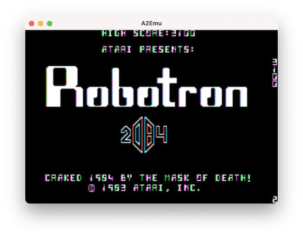

# Apple2TC
Convert classic Apple II games to runnable C code.

The goal of the project is to automatically convert classic Apple II games to
modern C code, buildable and runnable on modern systems. While it may sound
farfetched, I believe it is an achievable goal, if a few caveats are considered:
- The generated C code is not expected to be fully readable.
- The sound and graphics will be the *original Apple II* sound and graphics, but
emulated on top of modern libraries.

The project (will) consist of several components:
- [a2emu](https://tmikov.github.io/apple2tc/): an Apple2 emulator for running the original game and for *extracting and
recording runtime knowledge about it based on dynamic behavior*.
- A library implementing Apple II sound and graphics. This library will be used
both by the emulator and by the generated C code.
- A jump tracing 6502 disassembler augmented with runtime code coverage data
from the emulator. For debugging purposes, we would like to be able to see
the assembly code we are working with.
- A SSA based decompiler. Starting with the disassembled representation, we can
convert it to SSA and perform analysis and conversion passes. We can identify
subroutines, parameters, loops, and so on. We expect that this will be
incremental work, resulting in better and better quality of the generated C
code, but we should be able to produce working, albeit "ugly", C code from the
beginning.

## a2emu: Apple II Emulator

- Source: https://github.com/tmikov/apple2tc/tree/master/tools/a2emu
- Online version: https://tmikov.github.io/apple2tc/ . Use F1 and F2 to load and run example games.

 
The first version of the Apple II emulator is already up. It is portable and
should work on MacOS, Linux, Windows and Web, although as of this writing only
MacOS and Web have been tested.

This is not intended to be a fancy all-powerful Apple II emulator, with bells
and whistles, all possible emulated hardware support, super precise timing, etc.
Our goal here is to generated runnable C code, not to emulate the Apple II.
Plus, there are many existing Apple II emulators, and one more is not really
that exciting or useful on its own.

With that said, A2emu is very simple, extremely easily buildable (has no
external dependencies!), and portable across many platforms, which puts it in a
fairly unique space.

Status:
- Two test games (Bolo and Robotron 2084) work and can be executed with F1/F2.
- Text, GR and HGR modes implemented
- Keyboard support implemented
- Diskelss games seem to work.
- Applesoft Basic works.

Missing:
- Colors in HiRes mode need some improvement.
- The emulator code is not super flexible in how it handles IO, since this is
not supposed to be a very powerful emulator.
- Sound: coming soon.
- Tape support (we may be add it soon, because it seems simple and may be a
convenient way to save restore).
- Disk support. No plans to add it for now, since it appears to be a non-trivial
amount of work and does not seem to be strictly necessary for the project. Who
knows, perhaps inspiration will strike, or someone will decide to contribute it.

## Disassembler

For now we have implemented a simple interactive disassembler for initial
investigation of binaries.

https://github.com/tmikov/apple2tc/tree/work/tools/id

It supports disassembling, dumping of data, and jumping around the memory. It
knows about builtin Apple II symbols.
